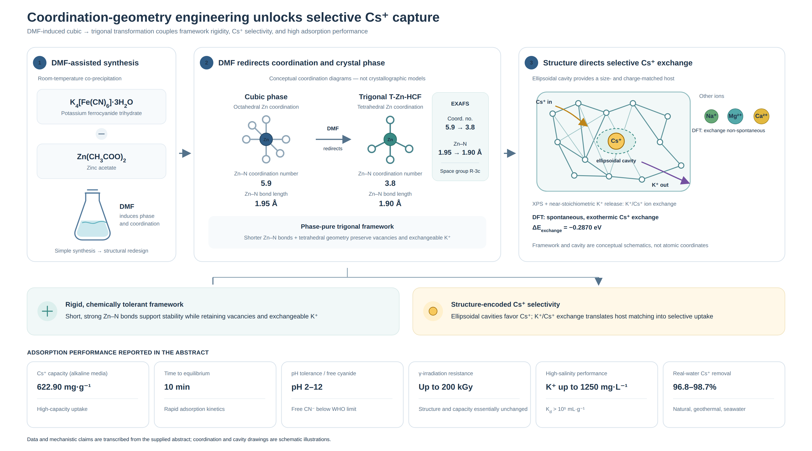

# Zn-HCF 图形摘要

- **图稿：** `zn-hcf-graphical-abstract.svg` 是可编辑、自包含矢量图；`zn-hcf-graphical-abstract.png` 是 2× 分辨率预览。SVG 使用文本标签和内嵌图形，无外部图像或字体依赖。
- **内容：** 按“DMF 辅助共沉淀 → 立方/八面体向三方/四面体转变 → 结构优势 → Cs⁺ 选择性吸附 → 性能”的逻辑重新组织，突出配位几何变化与吸附性能之间的因果联系。
- **科学信息：** EXAFS 配位数和 Zn–N 键长、R-3c 空间群、K⁺/Cs⁺ 交换及 DFT 能量和性能数据均来自用户提供的摘要。结构/空腔及配位图均为概念示意，不代表原子坐标；没有推断交换化学计量。原始参考图 `docs/微信图片_20261009101513_754_24.png` 保持不变。
- **打开、编辑和导出：** 可用浏览器预览 SVG，或在 Inkscape 等矢量编辑器中编辑；在 Inkscape 中可将 SVG 导出为其他尺寸的 PNG 或 PDF。
